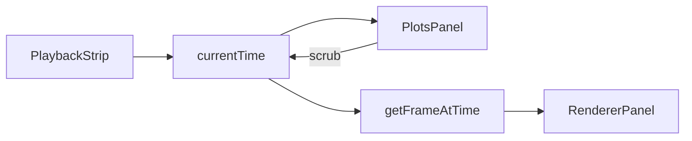

# MGView plotting scope

**Status:** draft (iterating). Parent: [`mgview-in-place-modernization.md`](mgview-in-place-modernization.md).

Handoff for **simulation channel charts** in the modern React app. Use this doc for product and implementation planning; update in-repo rather than relying on chat history.

---

## Context

Modernization lists plotting as top “next work”: simulation channel charts. The app already has most of the data path:

| Existing piece | Location |
|----------------|----------|
| `.1` parse (`t` + channels) | [`frontend/src/core/parseSimulationText.ts`](frontend/src/core/parseSimulationText.ts) |
| Multi-file merge | [`frontend/src/core/timeline.ts`](frontend/src/core/timeline.ts) (`buildTimeline`) |
| Playback + 3D frame | [`getFrameAtTime`](frontend/src/core/timeline.ts), [`PlaybackStrip`](frontend/src/components/PlaybackStrip.tsx), [`RendererPanel`](frontend/src/components/RendererPanel.tsx) |
| Channel naming / inference | [`frontend/src/core/simulationChannels.ts`](frontend/src/core/simulationChannels.ts) |
| Sim file management | [`SimulationDataOverlay`](frontend/src/components/SimulationDataOverlay.tsx) |

Legacy MGView did **not** ship in-app 2D plots. This is a **new capability** (not legacy parity): inspect the same streams that drive the renderer while scrubbing/playing.

---

## User-facing goal

Let users **inspect simulation channels over time** alongside the 3D view, without exporting to MATLAB/Python first.

Default chart: **Y vs `t`** (shared time axis), with **multiple series** per panel when scales are compatible.

---

## Layout

### v1 — Plots tab in the inspector drawer

Keep the existing workspace grid (object list + inspector drawer). Add **Plots** as a fourth tab in [`InspectorDrawer`](frontend/src/components/InspectorDrawer.tsx), sibling to **Editor**, **Scene Settings**, and **JSON Editor**:

```text
┌─────────────────────────────┐  ┌──────────┬──────────────────────────┐
│                             │  │ Objects  │ [Editor|Scene|JSON|Plots]│
│   Three.js viewport         │  │  list    │ ┌────────────────────────┐ │
│                             │  │          │ │ Plot panel 1           │ │
│                             │  │          │ ├────────────────────────┤ │
├─────────────────────────────┤  │          │ │ Plot panel 2           │ │
│  Playback strip             │  │          │ │ … (scrollable)         │ │
└─────────────────────────────┘  └──────────┴──────────────────────────┘
```

- Extend `InspectorEditorMode` (or equivalent) with `'plots'`.
- Tab button selects plot UI; object list stays visible and usable.
- Plot area: **scrollable stack** of one or more panels inside the drawer content region (same `min-h-0 overflow-auto` pattern as other tabs).
- **No shell/grid changes** for v1—focus on charts, channel config, and playback sync before revisiting macro layout.

Implementation sketch: `PlotsPanel.tsx` rendered from `TabsContent value="plots"`; wire `timeline`, `currentTime`, `channelNames`, and draft-scene plot config from `App.tsx` like other drawer tabs.

### Later (deferred) — dedicated plot rail

Previously considered: plots **replace** the entire right column (object list + drawer) so analysis gets maximum width. Revisit after v1 plots work well in the drawer—may need wider `workspace-left-rail` columns or a shell mode toggle in [`app.css`](frontend/src/app.css) / [`App.tsx`](frontend/src/App.tsx).

---

## Persistence (scene JSON)

Plot configuration is **saved with the scene**, not session-only.

- Extend the scene JSON schema with a structured `plots` (name TBD) section.
- Load: apply saved panels/channels when scene loads; tolerate missing/unknown channels (warn in diagnostics).
- Save: include plot config in [`createSavableScene`](frontend/src/hooks/useSceneWorkspace.ts) output; migration policy for older scenes without the field (default empty → show editor rail or empty plot stack).
- **GitHub Pages / samples:** bundled sample JSON can ship with example plot presets; read-only demo still renders saved plots when channels exist.

Open schema questions (decide during implementation):

- Per-panel: `channels: string[]`, optional `title`, optional `yAxis` / dual-axis mode.
- Global vs per-panel time range override (default: full timeline).
- Version field or implicit forward-compatible parsing.

---

## Functional scope

### MVP

| Capability | Behavior |
|------------|----------|
| **Plots tab** | Fourth inspector tab; scrollable stack of one or more plot panels. |
| **Channel picker** | Searchable multi-select from `channelNames`; monospace labels; empty state when no sim data. |
| **Live cursor** | Vertical marker at `playback.currentTime` on each panel. |
| **Scrub from plot** | Interaction on time axis updates shared `currentTime` (same as playback strip). |
| **Zoom/pan** | X (time) zoom/pan per panel; reset to `[tInitial, tFinal]`. |
| **Theme** | Axes/grid/series follow light/dark tokens ([`index.css`](frontend/src/index.css)). |
| **Saved config** | Panels and channel lists round-trip in scene JSON. |

### Selection-aware helpers (MVP-friendly)

When an object/span is selected:

- Quick-add bundles: `P_<origin>_<obj>[1..3]`, `N_<frame>_<obj>[i,j]` (reuse grouping from `SimulationDataOverlay`).
- Obvious scalars (`qA`, `Ta`, …) via name overlap with selection.

Optional: “Add to plot…” action writes into draft scene plot config (not only ephemeral UI).

### Phase 2

| Capability | Behavior |
|------------|----------|
| **Panel templates** | Presets in UI (“All `q*`”, “Energy”, “Selection pose”) that write into scene JSON. |
| **Y-axis modes** | Shared vs split axis when scales differ. |
| **Hover readout** | Crosshair + tooltip at nearest sample (match discrete timeline indexing unless interpolation is upgraded globally). |
| **Export** | PNG per panel; optional CSV for visible series + time range. |
| **Header units** | Parse `% (second)` / `(UNITS)` from `.1` comment lines for axis labels. |

### Phase 3 (optional)

- Phase plane plots (Y vs Y′ or channel vs channel).
- Linked zoom across panels.
- Diagnostics deep-links to missing channels referenced in plot config.

### Non-goals (v1)

- JSON **editor** tab (separate gap).
- Plots inside the WebGL canvas.
- Live streaming simulation.
- Changing time lookup semantics in only the plot layer (stay consistent with [`getFrameAtTime`](frontend/src/core/timeline.ts) unless both 3D and plots upgrade together).

---

## Technical scope

### Data layer

New module e.g. [`frontend/src/core/plotSeries.ts`](frontend/src/core/plotSeries.ts):

- Input: `Timeline`, `channelNames[]` per panel.
- Output per series: `{ id, label, times, values }` built when timeline changes (not every animation frame).
- Validation: channel exists in timeline; surface warnings via existing diagnostics pipeline.

### Scene model

- Types in [`frontend/src/core/types.ts`](frontend/src/core/types.ts).
- Normalize defaults in [`sceneDocument.ts`](frontend/src/core/sceneDocument.ts).
- Save strip/normalize in [`createSavableScene`](frontend/src/hooks/useSceneWorkspace.ts).

### UI components (sketch)

| Component | Role |
|-----------|------|
| `PlotsPanel.tsx` | Inspector tab body: scroll stack of panels, add/remove panel |
| `PlotPanel.tsx` | One uPlot instance + channel picker + legend |
| `PlotChannelPicker.tsx` | Filtered multi-select (`ScrollArea` / combobox) |
| `plotTheme.ts` | CSS variables → uPlot colors |

Extend [`InspectorDrawer`](frontend/src/components/InspectorDrawer.tsx) (`TabsTrigger` + `TabsContent`). Plot config lives in draft scene; `editorMode === 'plots'` only controls which tab is visible (same pattern as `visual` / `scene` / `json`).

### Playback coupling



Single `currentTime` source of truth.

### Performance

Target: smooth cursor updates during playback with **≥50k points per series** (downsample only if measured necessary). Sample scenes are smaller; workspace runs may be large.

### Tests

- Unit: `plotSeries` extraction; schema round-trip for plot config.
- Fixture: one panel + channels from `samples/robot_arm/circle_step/robot_arm.1`.

---

## Library

**[uPlot](https://github.com/szopiory/uPlot)** — chosen for v1.

| Criterion | Notes |
|-----------|--------|
| Fit | Fast multi-series **time vs value**. |
| Bundle | Small next to Three.js. |
| Cursor | Plugin for vertical playback line. |
| Theme | Map `--foreground`, `--border`, `--primary` on theme change. |
| React | Thin ref/effect wrapper (same lifecycle style as Three.js). |

**Tradeoff:** Imperative API; own resize/destroy lifecycle (use `ResizeObserver` on the drawer panel).

Deferred alternatives: visx (React + D3), Plotly/ECharts (heavy). Raw D3 alone is unnecessary boilerplate for standard line charts.

---

## Delivery phases

1. **Schema + types** — `plots` in scene JSON; load/save/migrate; empty default.
2. **Plots tab shell** — fourth `InspectorDrawer` tab; empty scroll region; `editorMode` wiring.
3. **MVP chart** — one panel, uPlot, multi-channel, cursor + scrub, saved channels.
4. **Multi-panel stack** — add/remove panels in JSON; selection quick-add.
5. **Polish** — zoom, export, units from headers, keyboard/focus (coordinate with modernization item #2).
6. **Layout (optional)** — dedicated plot rail if drawer width is insufficient.

---

## Open decisions

| Topic | Options |
|-------|---------|
| Unknown channels on load | Strip + warning vs keep label in UI grayed out |
| Interpolation | Discrete frames only (match 3D) vs upgrade globally |
| Plot section name in JSON | `plots`, `plotPanels`, `charts`, … |
| Demo/samples | Ship example `plots` in select bundled scenes |

---

## Changelog (doc)

- **2026-05-31:** v1 layout → Plots tab in `InspectorDrawer`; uPlot locked; full right-rail layout deferred.
- **2026-05-31:** Initial draft; persistence via scene JSON; right-rail layout (later deferred).
