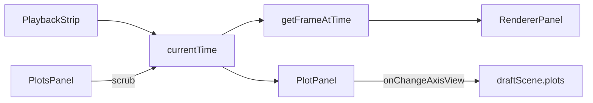

# MGView plotting scope

**Status:** MVP + axis polish (Y vs t + Y vs X, persisted zoom/pan, latching zoom-to-fit). Parent: [`mgview-in-place-modernization.md`](mgview-in-place-modernization.md).

Handoff for **simulation channel charts** in the modern React app. **Update this file in-repo** when plotting behavior changes; do not rely on chat history.

---

## Quick handoff

Charts **render and sync with playback**. Smoke test: **Robot Arm → Circle Step** ([`robot_arm.json`](samples/robot_arm/circle_step/robot_arm.json)), `simulationData: ["robot_arm.1:6"]`.

| Mode | UI | Chart behavior |
|------|-----|----------------|
| **Y vs t** (default) | Gear → channel filter; **Y vs t / Y vs X** toggle; **Zoom to fit** | Multi-series vs time; drag scrubs time; **Shift+drag** 2D manual zoom (leaves zoom-to-fit); channel chips below |
| **Y vs X** | Gear → filter, Y/X dropdowns + **scale** (default 1, e.g. **-1** to flip), mode toggle, **swap** (↔), **Zoom to fit**, **Square** | Parametric path; labels = channel names; playback dot; **Square** (header button or key **`1`**); drag → nearest-sample scrub; **Shift+drag** 2D manual zoom |

**Build / run:** `cd frontend && npm run build` — [`bin/RunVisualizer.bat`](../bin/RunVisualizer.bat) → `http://localhost:8000/mgview/`.

### Smoke steps

1. `cd frontend && npm test && npm run build`
2. Load Circle Step.
3. **Y vs t** torque panel (`Ta`, `Tb`, `Tcd`): lines visible; drag scrubs; **Zoom to fit** filled = fit on; Shift+drag zooms X and Y (button dims **on press**, fit off after release); click **Zoom to fit** to restore; save scene → reload → manual limits preserved if saved.
4. After zoom/pan, **Zoom to fit** is dashed/muted: Shift+drag zooms; right-drag (two-finger on Mac) pans; edit limits in settings; save/reload manual limits; click **Zoom to fit** to refit.
5. Add panel → scrolls into view.
6. Switch to **Y vs X** — keeps `channels[0]` as Y, sets `xChannel` from `channels[1]` if present; **axis fields cleared** on mode/channel change.
7. Y vs X: `P_No_Eo[1]` vs `P_No_Eo[3]` → closed loop + dot; bottom axis label visible. (**Square** control hidden until fixed — see [`mgview-plot-square-aspect.md`](mgview-plot-square-aspect.md).)

---

## Panel header controls

| Control | Behavior |
|---------|----------|
| Title | Inline editable → `plots.panels[].title` |
| **Settings** (gear) | Channels, mode, axis hints; manual limit inputs when zoom-to-fit is off |
| **Zoom to fit** (focus icon) | **Latching.** **On:** primary fill + ring — axes follow full data span ([`plotPanelZoomToFitActive`](frontend/src/core/plotAxisConfig.ts)). **Off:** dashed/muted after zoom/pan (dims **on pointer-down** for Shift+drag or right-drag pan, before commit). Click to clear stored limits and refit. No separate “reset view” control. |
| **Square** (square icon, Y vs X only) | **Disabled in UI** (`SQUARE_ASPECT_UI_ENABLED = false`) — sizing broken; see [`mgview-plot-square-aspect.md`](mgview-plot-square-aspect.md). |
| **X** | Remove panel |

**Not persisted:** square aspect — React local state in [`PlotPanel.tsx`](frontend/src/components/PlotPanel.tsx).

---

## Axis interaction (both Y vs t and Y vs X)

There is **no hybrid auto-scale** (no box-select zoom, no “auto Y refit to visible X” while zoom-to-fit is on). A panel is either in **zoom-to-fit** or **fully manual**.

| Zoom to fit | Gesture | Effect |
|------------|---------|--------|
| **On** (default) | Drag (no Shift) | Scrub playback: **Y vs t** → time from X; **Y vs X** → nearest sample in pixel space → `currentTime` |
| **On or off** | Shift + drag | Manual **X and Y** zoom (horizontal → X, vertical → Y). Header buttons dim on **pointer-down**; limits committed on **pointer-up** with `autoScale: false` + all four limits. |
| **On or off** | Right-drag | Pan X and Y (context menu suppressed). Same latch break as Shift+drag. |
| **Off** | Settings inputs | Edit `xMin`/`xMax`/`yMin`/`yMax` (labels: Time min/max for Y vs t); formatted display, rounded on save |

uPlot built-in drag zoom stays **off** (`cursor.drag.setScale: false`); box `select` overlay is **off**. Custom handlers in `attachScrubHandlers` inside [`PlotPanel.tsx`](frontend/src/components/PlotPanel.tsx).

**Pointer / limit updates (manual pan & zoom):**

- While dragging, limits are applied with `chart.setScale` only (`liveDragLimitsRef`); React `plotLimits` effects are skipped until the gesture ends (`panningRef` / `manualZoomRef` guard).
- **Commit to scene on pointer-up** (not every `pointermove`).
- One **active pointer id** per gesture; `pointerup`, `pointercancel`, and `lostpointercapture` share teardown.
- **Pan math** is **absolute** from press: `startPlotX/Y` + `startLimits`; pixel delta → data delta via **`chart.rect`**. Tune `PAN_DRAG_SCALE` at top of [`PlotPanel.tsx`](frontend/src/components/PlotPanel.tsx).
- **Manual zoom** uses `MANUAL_ZOOM_SENSITIVITY`; zoom is relative to limits at **pointer-down**.
- uPlot scales always use **`auto: false`** with explicit min/max (no uPlot auto Y after drag).

---

## Schema & persistence

```typescript
interface PlotPanelConfig {
  title?: string;
  channels: string[];         // Y vs t: many; Y vs X: [0] = Y
  xMode?: 'time' | 'channel'; // default 'time'
  xChannel?: string;          // required when xMode === 'channel'
  yChannelScale?: number;     // Y vs X only; default 1 (omit = 1)
  xChannelScale?: number;     // Y vs X only; default 1 (omit = 1)
  autoScale?: boolean;        // default true (omit = on); false = manual
  xMin?: number;
  xMax?: number;
  yMin?: number;
  yMax?: number;
}
```

**Zoom-to-fit active** when `autoScale !== false` and **no** stored axis fields ([`plotPanelHasStoredAxisFields`](frontend/src/core/plotAxisConfig.ts)). Resolved limits = [`computeFullPlotAxisLimits`](frontend/src/core/plotAxisConfig.ts) (Y vs t: time range + padded Y; Y vs X: padded X/Y extrema).

**What gets written to `scene.json`** ([`buildPersistedPlotAxisFields`](frontend/src/core/plotAxisConfig.ts)):

| State | Saved fields |
|-------|----------------|
| Zoom-to-fit (limits match full data span) | *(none — defaults)* |
| Manual / zoomed / panned | `autoScale: false` + `xMin`, `xMax`, `yMin`, `yMax` |

Legacy scenes may have only `xMin`/`xMax` without `autoScale: false`; those are treated as manual (stored fields present) — Y limits are **not** recomputed from visible X on load.

**Cleared** when: channels/mode change, click **Zoom to fit** (`mergePlotAxisFields(..., null)`), or panel signature change (channels / xChannel / series ids).

Example manual Y vs X panel:

```json
{
  "title": "Eo path",
  "xMode": "channel",
  "xChannel": "P_No_Eo[1]",
  "channels": ["P_No_Eo[3]"],
  "autoScale": false,
  "xMin": 0.2,
  "xMax": 0.8,
  "yMin": -0.1,
  "yMax": 0.1
}
```

Normalize on load: [`plotsConfig.ts`](frontend/src/core/plotsConfig.ts) (`finitePlotLimit`). Persist rounds via [`roundPlotAxisLimits`](frontend/src/core/plotAxisConfig.ts) / [`formatPlotAxisLimit`](frontend/src/core/plotAxisConfig.ts). Round-trip: [`createSavableScene`](frontend/src/hooks/useSceneWorkspace.ts) clones `draftScene.plots`.

---

## Key behavior

| Topic | Decision |
|-------|----------|
| JSON section | `plots.panels[]` |
| Unknown channels | Keep in config; “(missing)” in UI; warn in diagnostics |
| Time indexing | [`getFrameIndexAtTime`](frontend/src/core/timeline.ts) / [`getFrameAtTime`](frontend/src/core/timeline.ts) |
| Resolved limits | [`resolvePlotAxisLimits`](frontend/src/core/plotAxisConfig.ts) + [`computeFullPlotAxisLimits`](frontend/src/core/plotAxisConfig.ts) |
| `setData` | `plot.setData(data, false)` — scales updated in separate `setScale` effects |
| Y padding (fit mode) | 5% via `computePlotYBounds` in `computeFullPlotAxisLimits` only |
| XY series | `sorted: 0` for non-monotonic X |
| XY plot height | `PLOT_XY_DEFAULT_HEIGHT` (228) or square via `convergeSquarePlotSize` on `chart.rect` |
| XY playback dot | DOM `.plot-xy-marker` in `plot.over`; `#60a5fa` (TODO: series color) |
| Legend | Off; channel chips below chart (Y vs t only) |
| Mode switch | [`PlotsPanel`](frontend/src/components/PlotsPanel.tsx) atomic update + `mergePlotAxisFields(..., null)` |
| Square toggle | `setSize` in dedicated effect — **not** in uPlot mount deps |

**CSS pitfall:** Do not override uPlot `canvas` positioning under `.plot-panel-host`.

---

## Layout & playback

Plots tab in [`InspectorDrawer`](frontend/src/components/InspectorDrawer.tsx). `currentTime` via **ref** from [`PlotsPanel`](frontend/src/components/PlotsPanel.tsx) → [`PlotPanel`](frontend/src/components/PlotPanel.tsx) (no uPlot recreate per tick).



---

## Components & modules

| File | Role |
|------|------|
| [`PlotsPanel.tsx`](frontend/src/components/PlotsPanel.tsx) | Panel stack; wires config + `onChangeAxisView` → draft scene |
| [`PlotPanel.tsx`](frontend/src/components/PlotPanel.tsx) | uPlot lifecycle, pointer handlers, Zoom to fit / Square header buttons, settings |
| [`PlotChannelPicker.tsx`](frontend/src/components/PlotChannelPicker.tsx) | Searchable channel multi-select |
| [`plotAxisConfig.ts`](frontend/src/core/plotAxisConfig.ts) | `plotPanelZoomToFitActive`, `plotPanelHasStoredAxisFields`, resolve / persist / merge; limit formatting |
| [`plotSeries.ts`](frontend/src/core/plotSeries.ts) | `extractPlotPanelData`, `computePlotYBounds` |
| [`plotTheme.ts`](frontend/src/core/plotTheme.ts) | Canvas colors |
| [`plotsConfig.ts`](frontend/src/core/plotsConfig.ts) | `normalizePlotsConfig`, diagnostics |

**Library:** [uPlot](https://github.com/szopiory/uPlot) v1.6.x — mount in `useEffect`; plot **not** recreated on square-aspect or scale-only changes.

---

## Remaining work

**Polish**

- [ ] **Square aspect (Y vs X)** — broken; UI hidden. Handoff: [`mgview-plot-square-aspect.md`](mgview-plot-square-aspect.md)
- [ ] XY marker color from series theme (currently `#60a5fa` in CSS)
- [ ] Wheel zoom (custom; uPlot v1.6 has no `wheel` option)
- [ ] Persist `squareAspect` in JSON (optional; currently UI-only)

**Phase 2**

- [ ] Smarter channel suggestions (selection-aware)
- [ ] Panel templates (“All `q*`”, bundles)
- [ ] Dual Y-axis when magnitudes differ greatly
- [ ] Hover tooltip at nearest sample
- [ ] Export PNG / CSV
- [ ] Axis units from `.1` comment headers
- [ ] Time-axis label when plot expanded

**Deferred:** linked zoom across panels; dedicated plot rail; downsample ≥50k points if needed.

---

## Tests

```bash
cd frontend && npm test && npm run build
```

| File | Covers |
|------|--------|
| [`plotSeries.test.ts`](frontend/src/core/plotSeries.test.ts) | Extraction, Y vs X mode, `computePlotYBounds`, axis fields round-trip via `createSavableScene` |
| [`plotAxisConfig.test.ts`](frontend/src/core/plotAxisConfig.test.ts) | `plotPanelZoomToFitActive`, `buildPersistedPlotAxisFields`, `resolvePlotAxisLimits`, legacy partial fields |

---

## Agent notes (last update)

- **Done:** Binary **zoom-to-fit vs manual** (no box zoom, no partial X-only auto Y); **Zoom to fit** header latch with **optimistic button dim on pointer-down**; Shift+drag 2D manual zoom; right-drag pan from any state; click **Zoom to fit** to refit (no reset button); XY bottom axis `labelSize`/`labelGap`.
- **Blocked:** **Square** aspect (1:1 drawable area) — UI hidden; handoff [`mgview-plot-square-aspect.md`](mgview-plot-square-aspect.md).
- **Touch carefully:** `attachScrubHandlers` refs (`breakViewLatchesRef`, `commitAxisLimitsRef`, `liveDragLimitsRef`, `manualZoomRef`, `panningRef`, `squareAspectRef`); `zoomToFitUiOff` is UI-only until parent props update. `autoScaleRef` synced from props via `useEffect`, cleared in `breakViewLatches` during gesture — commits always call `buildPersistedPlotAxisFields(limits, fullLimits)` (full manual when differ).
- **Pan tuning:** `PAN_DRAG_SCALE` (default `1`); divisor = `chart.rect` width/height.
- **Next likely tasks:** fix square aspect (see handoff doc), wheel zoom, XY dot color from theme, optional `squareAspect` persistence.
