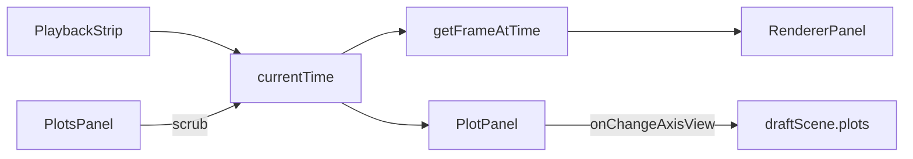

# MGView plotting scope

**Status:** MVP + axis polish (Y vs t + Y vs X, persisted zoom/pan). Parent: [`mgview-in-place-modernization.md`](mgview-in-place-modernization.md).

Handoff for **simulation channel charts** in the modern React app. **Update this file in-repo** when plotting behavior changes; do not rely on chat history.

---

## Quick handoff

Charts **render and sync with playback**. Smoke test: **Robot Arm → Circle Step** ([`robot_arm.json`](samples/robot_arm/circle_step/robot_arm.json)), `simulationData: ["robot_arm.1:6"]`.

| Mode | UI | Chart behavior |
|------|-----|----------------|
| **Y vs t** (default) | Gear → channel filter; **Y vs t / Y vs X** toggle; **Focus** (auto-scale); **Reset view** when zoomed | Multi-series vs time; drag scrubs time; **Shift+drag** box-zooms **time** (Y refits); channel chips below |
| **Y vs X** | Gear → filter, Y/X dropdowns, mode toggle, **swap** (↔), **Focus**, **Reset view** | Parametric path; labels = channel names; playback dot; **1:1 aspect** (settings checkbox or key **`1`**); drag → nearest-sample scrub; **Shift+drag** **2D** box-zoom when auto-scale on |

**Build / run:** `cd frontend && npm run build` — [`bin/RunVisualizer.bat`](../bin/RunVisualizer.bat) → `http://localhost:8000/mgview/`.

### Smoke steps

1. `cd frontend && npm test && npm run build`
2. Load Circle Step.
3. **Y vs t** torque panel (`Ta`, `Tb`, `Tcd`): lines visible; drag scrubs; **Focus** filled = auto-scale on; Shift+drag shows **highlighted** time region → zoom; **Reset view** restores; save scene → reload → zoom preserved if saved.
4. Toggle **Focus** off (dashed/muted): Shift+drag H or V zooms one axis; right-drag (two-finger on Mac) pans; edit limits in settings; save/reload manual limits.
5. Add panel → scrolls into view.
6. Switch to **Y vs X** — keeps `channels[0]` as Y, sets `xChannel` from `channels[1]` if present; **axis fields cleared** on mode/channel change.
7. Y vs X: `P_No_Eo[1]` vs `P_No_Eo[3]` → closed loop + dot; Shift+drag 2D region when auto-scale on.

---

## Panel header controls

| Control | Behavior |
|---------|----------|
| Title | Inline editable → `plots.panels[].title` |
| **Settings** (gear) | Channels, mode, axis hints, manual limit inputs |
| **Focus** (icon) | **Auto-scale toggle.** **On:** primary fill + ring. **Off:** dashed border + muted fill. Both plot modes. |
| **Reset view** | Shown when view differs from full data; clears stored axis fields (`mergePlotAxisFields(panel, null)`) |
| **X** | Remove panel |

**Not persisted:** `squareAspect` (Y vs X only) — React local state in [`PlotPanel.tsx`](frontend/src/components/PlotPanel.tsx).

---

## Axis interaction (both Y vs t and Y vs X)

| Auto-scale | Gesture | Effect |
|------------|---------|--------|
| **On** (default) | Shift + drag | **Box select** (`.u-select` styled in [`app.css`](frontend/src/app.css)). **Y vs t:** X window only; Y refits via [`computePlotYBounds`](frontend/src/core/plotSeries.ts). **Y vs X:** 2D box → both axes. |
| **On** | Drag (no Shift) | Scrub playback: **Y vs t** → time from X; **Y vs X** → nearest sample in pixel space → `currentTime` |
| **Off** | Shift + drag (dominant axis) | Horizontal → zoom X; vertical → zoom Y |
| **Off** | Right-drag | Pan X and Y (context menu suppressed on plot) |
| **Off** | Settings inputs | Edit `xMin`/`xMax`/`yMin`/`yMax` (labels: Time min/max for Y vs t) |

uPlot built-in drag zoom stays **off** (`cursor.drag.setScale: false`). Custom handlers in `attachScrubHandlers` inside [`PlotPanel.tsx`](frontend/src/components/PlotPanel.tsx). During pan/manual zoom, limits update via local `dragLimits` and **commit to scene on pointer-up** (avoids flooding draft on every move).

---

## Schema & persistence

```typescript
interface PlotPanelConfig {
  title?: string;
  channels: string[];         // Y vs t: many; Y vs X: [0] = Y
  xMode?: 'time' | 'channel'; // default 'time'
  xChannel?: string;          // required when xMode === 'channel'
  autoScale?: boolean;        // default true (omit = on)
  xMin?: number;
  xMax?: number;
  yMin?: number;
  yMax?: number;
}
```

**What gets written to `scene.json`** ([`buildPersistedPlotAxisFields`](frontend/src/core/plotAxisConfig.ts)):

| State | Saved fields |
|-------|----------------|
| Auto on, full view | *(none — defaults)* |
| Auto on, **Y vs t** zoomed | `xMin`, `xMax` only (Y recomputed on load) |
| Auto on, **Y vs X** zoomed | `xMin`, `xMax`, `yMin`, `yMax` |
| Auto **off** (manual) | `autoScale: false` + all four limits |

**Cleared** when: channels/mode change, **Reset view**, or panel signature change (channels / xChannel / series ids) via [`PlotsPanel`](frontend/src/components/PlotsPanel.tsx) / [`PlotPanel`](frontend/src/components/PlotPanel.tsx).

Example manual Y vs X panel:

```json
{
  "title": "Eo path",
  "xMode": "channel",
  "xChannel": "P_No_Eo[1]",
  "channels": ["P_No_Eo[3]"],
  "autoScale": false,
  "xMin": 0.2,
  "xMax": 0.8,
  "yMin": -0.1,
  "yMax": 0.1
}
```

Normalize on load: [`plotsConfig.ts`](frontend/src/core/plotsConfig.ts) (`finitePlotLimit` for stored numbers). Round-trip: [`createSavableScene`](frontend/src/hooks/useSceneWorkspace.ts) clones `draftScene.plots`.

---

## Key behavior

| Topic | Decision |
|-------|----------|
| JSON section | `plots.panels[]` |
| Unknown channels | Keep in config; “(missing)” in UI; warn in diagnostics |
| Time indexing | [`getFrameIndexAtTime`](frontend/src/core/timeline.ts) / [`getFrameAtTime`](frontend/src/core/timeline.ts) |
| Resolved limits | [`resolvePlotAxisLimits`](frontend/src/core/plotAxisConfig.ts) + [`computeFullPlotAxisLimits`](frontend/src/core/plotAxisConfig.ts) |
| `setData` | `plot.setData(data, false)` — scales updated in separate `setScale` effects |
| Y padding | 5% via `computePlotYBounds` |
| XY series | `sorted: 0` for non-monotonic X |
| XY playback dot | DOM `.plot-xy-marker` in `plot.over`; fixed `#60a5fa` (TODO: series color) |
| Legend | Off; channel chips below chart (Y vs t only) |
| Mode switch | [`PlotsPanel`](frontend/src/components/PlotsPanel.tsx) atomic update + `mergePlotAxisFields(..., null)` |

**CSS pitfall:** Do not override uPlot `canvas` positioning under `.plot-panel-host`. Selection overlay: `.plot-panel-host .u-select` in [`app.css`](frontend/src/app.css).

---

## Layout & playback

Plots tab in [`InspectorDrawer`](frontend/src/components/InspectorDrawer.tsx). `currentTime` via **ref** from [`PlotsPanel`](frontend/src/components/PlotsPanel.tsx) → [`PlotPanel`](frontend/src/components/PlotPanel.tsx) (no uPlot recreate per tick).



---

## Components & modules

| File | Role |
|------|------|
| [`PlotsPanel.tsx`](frontend/src/components/PlotsPanel.tsx) | Panel stack; wires config + `onChangeAxisView` → draft scene |
| [`PlotPanel.tsx`](frontend/src/components/PlotPanel.tsx) | uPlot lifecycle, pointer handlers, Focus/Reset UI, settings |
| [`PlotChannelPicker.tsx`](frontend/src/components/PlotChannelPicker.tsx) | Searchable channel multi-select |
| [`plotAxisConfig.ts`](frontend/src/core/plotAxisConfig.ts) | Resolve / persist / merge axis state |
| [`plotSeries.ts`](frontend/src/core/plotSeries.ts) | `extractPlotPanelData`, `computePlotYBounds` |
| [`plotTheme.ts`](frontend/src/core/plotTheme.ts) | Canvas colors |
| [`plotsConfig.ts`](frontend/src/core/plotsConfig.ts) | `normalizePlotsConfig`, diagnostics |

**Library:** [uPlot](https://github.com/szopiory/uPlot) v1.6.x — mount in `useEffect`; plot **not** recreated on every scale change (scale deps removed from mount effect).

---

## Remaining work

**Polish**

- [ ] XY marker color from series theme (currently `#60a5fa` in CSS)
- [ ] Wheel zoom (custom; uPlot v1.6 has no `wheel` option)
- [ ] Persist `squareAspect` in JSON (optional; currently UI-only)

**Phase 2**

- [ ] Smarter channel suggestions (selection-aware)
- [ ] Panel templates (“All `q*`”, bundles)
- [ ] Dual Y-axis when magnitudes differ greatly
- [ ] Hover tooltip at nearest sample
- [ ] Export PNG / CSV
- [ ] Axis units from `.1` comment headers
- [ ] Time-axis label when plot expanded

**Deferred:** linked zoom across panels; dedicated plot rail; downsample ≥50k points if needed.

---

## Tests

```bash
cd frontend && npm test && npm run build
```

| File | Covers |
|------|--------|
| [`plotSeries.test.ts`](frontend/src/core/plotSeries.test.ts) | Extraction, Y vs X mode, `computePlotYBounds`, axis fields round-trip via `createSavableScene` |
| [`plotAxisConfig.test.ts`](frontend/src/core/plotAxisConfig.test.ts) | `buildPersistedPlotAxisFields`, `mergePlotAxisFields`, `resolvePlotAxisLimits`, zoom detection |

---

## Agent notes (last update)

- **Done:** Unified axis UX for Y vs t and Y vs X; scene JSON persistence; visible Shift+drag selection; **Focus** button with strong on/off styling (`default` + ring vs dashed `outline`).
- **Touch carefully:** `attachScrubHandlers` uses refs (`autoScaleRef`, `commitAxisLimitsRef`) — stale closures if handlers read props without refs. `panelSignature` effect clears axis view only when signature **changes**, not on first mount.
- **Next likely tasks:** wheel zoom, XY dot color from theme, optional `squareAspect` persistence.
