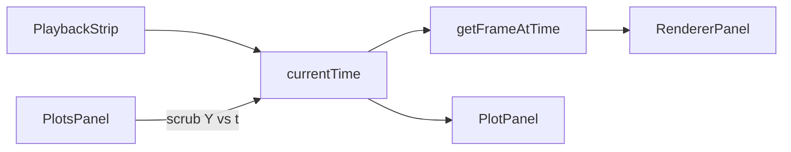

# MGView plotting scope

**Status:** MVP + polish (Y vs t + Y vs X). Parent: [`mgview-in-place-modernization.md`](mgview-in-place-modernization.md).

Handoff for **simulation channel charts** in the modern React app. Update in-repo; do not rely on chat history.

---

## Quick handoff

Charts **render and sync with playback**. Smoke test: **Robot Arm → Circle Step** ([`robot_arm.json`](samples/robot_arm/circle_step/robot_arm.json)), `simulationData: ["robot_arm.1:6"]`.

| Mode | UI | Chart behavior |
|------|-----|----------------|
| **Y vs t** (default) | Gear → channel filter + checkboxes; **Y vs t / Y vs X** toggle | Multi-series vs time; drag scrubs; **Shift+drag** box-zooms time; channel chips below chart |
| **Y vs X** | Gear → filter, Y/X dropdowns, mode toggle, **swap** (↔) | Parametric path; axis labels = channel names; custom playback dot; **1:1 aspect** (checkbox or **`1`**) |

**Build / run:** `cd frontend && npm run build` — [`bin/RunVisualizer.bat`](../bin/RunVisualizer.bat) → `http://localhost:8000/mgview/`.

**Smoke steps:** (1) Build. (2) Load Circle Step. (3) Torque panel (`Ta`, `Tb`, `Tcd`) — lines visible, drag scrubs, Shift+drag zooms, Reset zoom restores. (4) Add panel scrolls into view. (5) Switch to Y vs X — keeps first channel as Y, second as X. (6) Y vs X with X=`P_No_Eo[1]`, Y=`P_No_Eo[3]` → closed loop + moving dot.

---

## Panel UI

| Element | Behavior |
|---------|----------|
| Toolbar | **Add panel** only; hint when no sim data loaded |
| Title | Inline editable per panel |
| **Settings** (gear) | Channels, mode, axis options |
| **Y vs t / Y vs X** | In settings, right of channel filter |
| **Swap X↔Y** | Between X/Y dropdowns (Y vs X only) |
| **Reset zoom** | Header button when time-axis zoom active (Y vs t) |
| Remove panel | `X` in header |
| Time axis | No bottom `"t"` label; tick values show time |

**Mode switch (Y vs t → Y vs X):** Atomic draft update in [`PlotsPanel`](frontend/src/components/PlotsPanel.tsx) — keeps `channels[0]`, sets `xMode: 'channel'`, auto-fills `xChannel` from `channels[1]` when present.

---

## Schema

```typescript
interface PlotPanelConfig {
  title?: string;
  channels: string[];         // Y vs t: many; Y vs X: [0] = Y
  xMode?: 'time' | 'channel'; // default 'time'
  xChannel?: string;          // required when xMode === 'channel'
  autoScale?: boolean;        // default true
  xMin?: number; xMax?: number; yMin?: number; yMax?: number; // zoom / manual limits
}
```

Example Y vs X in scene JSON:

```json
{
  "title": "Eo path",
  "xMode": "channel",
  "xChannel": "P_No_Eo[1]",
  "channels": ["P_No_Eo[3]"]
}
```

---

## Key behavior

| Topic | Decision |
|-------|----------|
| JSON section | `plots.panels[]` |
| Unknown channels | Keep in config; “(missing)” in UI; warn in diagnostics |
| Time indexing | [`getFrameIndexAtTime`](frontend/src/core/timeline.ts) / [`getFrameAtTime`](frontend/src/core/timeline.ts) |
| Scrub | **Y vs t only:** drag without Shift on chart → `currentTime` |
| Zoom | **Y vs t:** auto-scale on → Shift+drag time region (Y refits); off → Shift H/V zoom, right-drag pan. **Y vs X:** auto → 2D box; off → same manual gestures. Persisted in `plots.panels[]` as `autoScale`, `xMin`/`xMax`/`yMin`/`yMax` |
| uPlot drag | Disabled (`setScale: false`); zoom is custom pointer handlers |
| `setData` | `plot.setData(data, false)` — do not reset scales every tick |
| Y scale (Y vs t) | Explicit min/max from all series + 5% pad |
| XY series | One Y (`channels[0]`), X from `xChannel`; `sorted: 0` for parametric loops |
| XY playback dot | Custom DOM marker in `plot.over` using frame index (uPlot cursor jumps on closed paths) |
| Legend | Off; channel chips below chart instead |

**Y vs X data:** [`extractPlotPanelData`](frontend/src/core/plotSeries.ts) — `xValues` from `xChannel`, Y from `channels[0]`, axis labels = channel names. Drag scrubs to nearest sample; axis zoom/pan matches Y vs t (see [`plotAxisConfig.ts`](frontend/src/core/plotAxisConfig.ts)).

**CSS pitfall:** Do not override uPlot `canvas` positioning under `.plot-panel-host` — breaks layered canvases. Keep `.plot-panel-host { position: relative }` and `.uplot { width: 100% }` only.

---

## Layout & playback

Plots tab in [`InspectorDrawer`](frontend/src/components/InspectorDrawer.tsx). Scrollable panel stack. `currentTime` passed via **ref** from [`PlotsPanel`](frontend/src/components/PlotsPanel.tsx) to avoid re-creating uPlot every tick.



---

## Components

| File | Role |
|------|------|
| [`PlotsPanel.tsx`](frontend/src/components/PlotsPanel.tsx) | Panel stack, add/remove, scroll-on-add, mode switch |
| [`PlotPanel.tsx`](frontend/src/components/PlotPanel.tsx) | uPlot lifecycle, scrub/zoom, XY marker, settings UI |
| [`PlotChannelPicker.tsx`](frontend/src/components/PlotChannelPicker.tsx) | Searchable channel multi-select |
| [`plotSeries.ts`](frontend/src/core/plotSeries.ts) | Timeline → arrays; `computePlotYBounds` |
| [`plotTheme.ts`](frontend/src/core/plotTheme.ts) | Hex colors for canvas |
| [`plotsConfig.ts`](frontend/src/core/plotsConfig.ts) | Normalize + diagnostics |

Data path: [`parseSimulationText.ts`](frontend/src/core/parseSimulationText.ts) → [`timeline.ts`](frontend/src/core/timeline.ts) → [`simulationChannels.ts`](frontend/src/core/simulationChannels.ts).

**Library:** [uPlot](https://github.com/szopiory/uPlot) v1.6.x — imperative mount in `useLayoutEffect`; native drag zoom off.

---

## Remaining work

**Polish**

- [x] XY scrub (pointer → nearest sample → `currentTime`)
- [x] XY shift-drag 2D zoom + reset (persisted axis fields)
- [ ] XY marker color from series theme (currently fixed `#60a5fa`)
- [ ] Wheel zoom (custom; uPlot v1.6 has no `wheel` option)

**Phase 2**

- [ ] Smarter channel suggestions (selection-aware, clearable / dynamic — removed naive “Plot object” buttons)
- [ ] Panel templates (“All `q*`”, bundles)
- [ ] Dual Y-axis when magnitudes differ greatly
- [ ] Hover tooltip at nearest sample
- [ ] Export PNG / CSV
- [ ] Axis units from `.1` comment headers
- [ ] Time-axis label when plot expanded

**Deferred:** linked zoom across panels; dedicated plot rail; downsample ≥50k points if needed.

---

## Tests

```bash
cd frontend && npm test && npm run build
```

[`plotSeries.test.ts`](frontend/src/core/plotSeries.test.ts) — extraction, `xMode: 'channel'`, save round-trip, `computePlotYBounds`.
