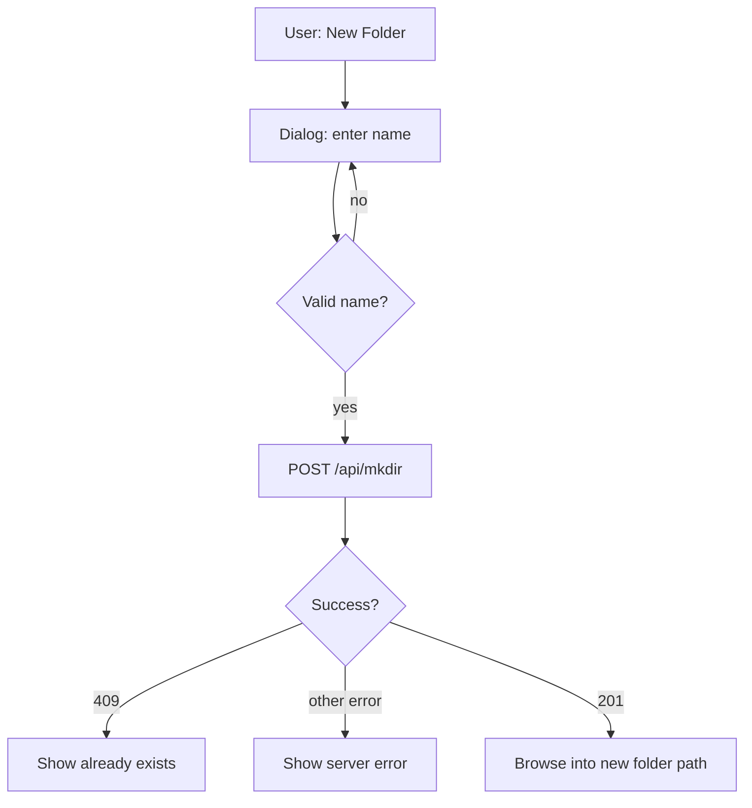

# Workspace browser — New Folder scope

**Status:** Not started. Parent: [`mgview-in-place-modernization.md`](mgview-in-place-modernization.md), [`mgview-scene-sources-split.md`](mgview-scene-sources-split.md).

Handoff for **New Folder** in the workspace file browser (Load, Create, Save As overlays). Update in-repo; do not rely on chat history.

**In scope:** create an empty folder in the current browse location and **auto-navigate into it**.

**Out of scope (this pass):**

- Delete, rename, or move files/folders in MGView — users use Finder / Explorer.
- **Save As asset handling** (copy sim files, meshes, rewrite paths) — deferred; needs more product definition before implementation (see [Deferred: Save As assets](#deferred-save-as-assets)).

---

## Quick handoff

| Feature | Where | Server required |
|---------|--------|-----------------|
| **New Folder** | Load / Create / Save As overlays ([`LoadSceneOverlay.tsx`](frontend/src/components/LoadSceneOverlay.tsx)) | Yes (`canPersistScenesToServer`) |

**Build / run:** `cd frontend && npm run build` — [`bin/RunVisualizer.bat`](../bin/RunVisualizer.bat) → `http://localhost:8000/mgview/`.

**Smoke test:**

1. Open **Load…** (or **New…** / **Save As…**).
2. Click **New Folder** → dialog → enter `test_project` → confirm.
3. Browser navigates into `test_project/` (empty listing).
4. **New…** → create `scene.json` in that folder → scene loads.

---

## UX

| Element | Behavior |
|---------|----------|
| Button | **New Folder** on [`LocalFileBrowser`](frontend/src/components/LocalFileBrowser.tsx) via `titleActions` (pattern: [`SimulationDataOverlay`](frontend/src/components/SimulationDataOverlay.tsx)) |
| Visibility | Workspace browser only; hidden when `canPersistScenes=false` (online demo) |
| Name entry | **In-app dialog** (shadcn-style, consistent with existing UI — not `window.prompt`) |
| Input | Single folder **name** only (not a path with slashes) |
| Validation | Non-empty after trim; reject `/`, `\`, `..`; reject names starting with `.` (matches server listing filter) |
| On success | **Auto-navigate** into the new folder (`handleBrowse(newFolderPath)`) |
| On duplicate | Error in dialog or overlay (`409` → “Folder already exists”) |
| On failure | Show server error; keep dialog open or dismiss with message; do not close parent overlay |

**Do not** add delete, rename, or move actions.

---

## Server API (new)

```
POST /mgview/api/mkdir?root=workspace&path=<logical-path>
```

| Rule | Detail |
|------|--------|
| `root` | **`workspace` only** (samples/app are read-only) |
| `path` | Logical path relative to workspace root; client builds via [`combineBrowserPath(browserPath, name)`](frontend/src/hooks/useWorkspaceShell.ts) |
| Creates | Single directory; **`recursive: false`** — parent must already exist (user browses there first) |
| Security | Same guards as list/file: [`resolveLogicalPathForRoot`](bin/workspaceRoots.js), no `..`, confined to workspace root |
| Response | `201 { ok: true, path: "..." }` or `409` if exists |

Add handler in [`bin/server.js`](bin/server.js) alongside existing list/file routes; use `fs.mkdir(resolvedPath, { recursive: false })`.

---

## Frontend wiring

1. **Validation helper** — e.g. `isValidFolderName(name: string): string | null` (returns error message or null); unit test.
2. [`frontend/src/api/localFilesServer.ts`](frontend/src/api/localFilesServer.ts) — `createWorkspaceDirectory(path: string)`.
3. [`frontend/src/api/localFiles.ts`](frontend/src/api/localFiles.ts) — export; static impl throws (same pattern as workspace picker).
4. **Dialog component** — small modal: title “New Folder”, text input, Cancel / Create; wired from overlay.
5. [`LoadSceneOverlay.tsx`](frontend/src/components/LoadSceneOverlay.tsx) — when `canPersistScenes`, pass `titleActions` with **New Folder** → opens dialog → `onCreateFolder(name)`.
6. [`useWorkspaceShell.ts`](frontend/src/hooks/useWorkspaceShell.ts) — `handleCreateFolder(name)`:
   - validate name
   - `folderPath = combineBrowserPath(browserPath, name)`
   - `await createWorkspaceDirectory(folderPath)`
   - `await handleBrowse(folderPath, 'workspace')` (auto-navigate)

Create / Save As overlays reuse the same `LoadSceneOverlay` + workspace browse path — no separate wiring beyond what the overlay already shares.

---

## Key files

| Area | Files |
|------|--------|
| Browser UI | [`LocalFileBrowser.tsx`](frontend/src/components/LocalFileBrowser.tsx), [`LoadSceneOverlay.tsx`](frontend/src/components/LoadSceneOverlay.tsx) |
| Shell | [`useWorkspaceShell.ts`](frontend/src/hooks/useWorkspaceShell.ts) |
| Server | [`bin/server.js`](bin/server.js), [`bin/workspaceRoots.js`](bin/workspaceRoots.js) |
| API client | [`localFilesServer.ts`](frontend/src/api/localFilesServer.ts), [`localFiles.ts`](frontend/src/api/localFiles.ts) |

---

## Tests

```bash
cd frontend && npm test && npm run build
```

- Unit: folder name validation (empty, slashes, `..`, leading dot).
- Manual: mkdir success, duplicate name, forbidden path, auto-navigate after create.

---

## mermaid — New Folder flow



---

## Deferred: Save As assets

**Not in scope for this handoff.** Save As today only writes the scene JSON ([`handleSaveSceneAs`](frontend/src/hooks/useSceneWorkspace.ts)); sim files (`.1`, etc.) and mesh paths (`.obj`, `.stl`) are not copied or rewritten, so saving a sample or moving a scene to a new folder often breaks playback/rendering until the user fixes paths manually.

A future pass would need clearer product rules before implementation, including:

- Copy vs reference-only modes when saving workspace scenes to a new location
- Behavior for sample → workspace (likely must copy assets into workspace)
- Layout when copying (flat vs mirroring source directory structure)
- Meshes with `..` paths outside the scene folder
- Collision / partial-failure policy
- New server APIs (generic file copy, not just JSON create)

Do **not** start this work as part of the New Folder task. When picked up again, expand this section or add a separate scope doc.
